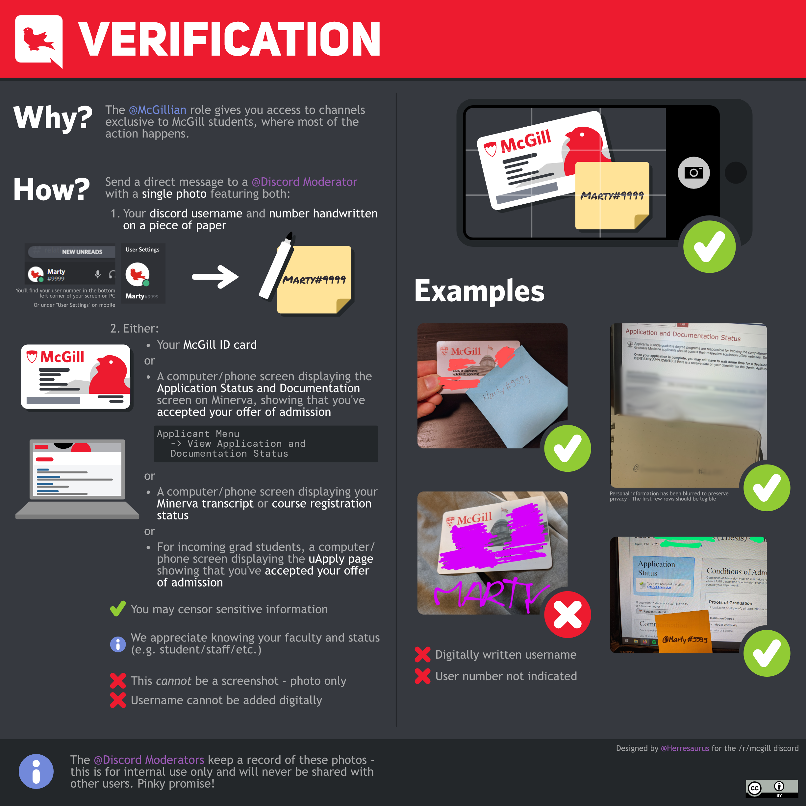

━━━━━━━━━━━━━━━━━━
✅ **VERIFICATION**
━━━━━━━━━━━━━━━━━━
Message a @Discord Moderator to be verified as a McGillian. As shown in the infographic, end a Discord Moderator a pic of your ID or transcript with any personal info blocked out and with a bit of paper with your username on it. **WE DO NOT ACCEPT VERIFICATION WITH A DIGITALLY ADDED USERNAME – USE PAPER IN THE FRAME**. Or you could meet one of us in person, or have someone who is also verified vouch for you. **At minimum, have the McGill logo, and faculty visible**. It's nice but not required for your status (staff, student, etc.) to be visible too. We post screencaps of verification messages in a channel visible only to Discord Moderators.

