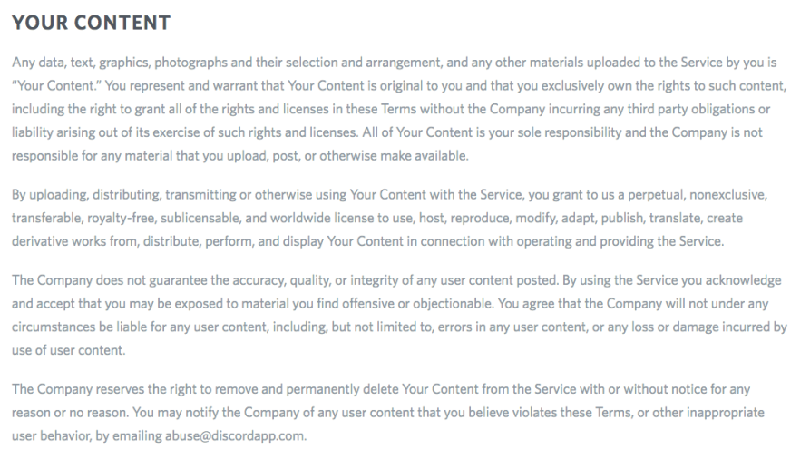

━━━━━━━━━━━━━━━━━━
💬 **CHANNELS**
━━━━━━━━━━━━━━━━━━
Open Access and Bots channels are open to every Discord user.
McGill-Only channels are restricted to verified McGill students only. Message a @Discord Moderator to be verified as a @ McGillian and have access to these channels. Additionally, an irl channel is accessible to verified McGill users who attend a meetup.

#NEWMSG
━━━━━━━━━━━━━━━━━━
🏷 **ROLES**
━━━━━━━━━━━━━━━━━━
@ Discord Moderator = Moderators of this Discord. Their rule is law!
@ Reddit Moderator = They are the actual reddit Moderators who moderate /r/mcgill.
@ McGillian = Verified McGill students.
Additional roles can be also be used to notify all of the people who are interested in a certain activity or subject. Message or ping a @Discord Moderator to have a role added such as your major.
@ irl = McGillians who attended at least one meetup or met a mod IRL
@ stm_alertee = for real-time STM status on discord, just type `.iam stm_alertee` to get the role and get access to #stm_alerts

We have several user-assignable roles available for users to identify their pronouns, year, fields of study, and interests.

To view a list of assignable roles, go to the #bots channel and type `?iam`. There are several categories of roles: `pronouns`, `fields`, `faculties`, `years`, and `generics`. You can view all roles within a specific category with e.g. `?iam pronouns`, and then assign a specific role with `?iam [Pronoun/Pronouns]`.

To un-assign a role, use the `?iamn [role]` command.

#NEWMSG
━━━━━━━━━━━━━━━━━━
🚑 **SAFETY RESOURCES**
━━━━━━━━━━━━━━━━━━
__911 for all emergencies__ (also dial 514-398-3000 on downtown campus or 514-398-7777 at Mac campus for Security Services so 1st-responders can reach your location)
__SSMU Walksafe__ 514-398-2498 will walk you home from anywhere on the island of MTL 21:00-00:00 Sun-Thurs & 21:00-03:00 Fri-Sat
__SSMU Drivesafe__ 514-398-8040 will drive you home *for free* Thurs-Sat 23:00-03:00. They're a service to help you get *home* safely, not a taxi service.

#NEWMSG
━━━━━━━━━━━━━━━━━━
👩‍⚕️ **HEALTH RESOURCES**
━━━━━━━━━━━━━━━━━━
Please consult these resources if you need them. We try to be a supportive server but we are not professionals and cannot assume liability for any advice given.
__keep.meSAFE__ - free, confidential, 24/7 professional counselling service. Download the MySSP app and chat/call for same-day or appointment-based support.
__Student Wellness Hub__ https://www.mcgill.ca/wellness-hub/ 514-398-6017 - your first stop for health and wellness resources at McGill.
__Nightline__ http://nightline.ssmu.ca/ 514-398-6246 - referral service available over the phone daily 18h–03h. Nightline also has an online Chatline.
__Peer Support Centre__ https://psc.ssmu.ca/about-us/ - McGill students trained as peer supporters, available over Zoom for active listening, 11am-5pm on weekdays.
__McGill Counseling__ 514-398-3601 (downtown), 514-398-7992 (Mac campus) - offers crisis drop-in, workshops, and intake if you need any other assistance.
__McGill Psychiatric Services__ https://mcgill.ca/psychiatric-services 514-398-6019 has safety appointments M-F 11h-13h offered on a 1st-come, 1st served basis.
__Eating Disorders__ https://ssmu.ca/resources/eating-disorders/ - resources, advocacy, and peer support groups for McGill students facing eating disorders and/or disordered eating.
__SACOMSS__ https://www.sacomss.org/wp/ - SSMU's Sexual Assault Centre offers a variety of support services for those who have experienced sexual assault, including drop-in and phone counseling.
__OSVRSE__ https://www.mcgill.ca/osvrse/ is the McGill Office for Sexual Violence Response, Support and Education. Response advisor reachable at 514-398-4486.

#NEWMSG
━━━━━━━━━━━━━━━━━━
⚖ **LEGAL RESOURCES**
━━━━━━━━━━━━━━━━━━
__Legal Information Clinic__ https://licm.ca/ is a free student-run legal information service covering residential lease, family law, employment law, civil procedure and McGill's internal policies.

#NEWMSG
━━━━━━━━━━━━━━━━━━
🤫 **PRIVACY**
━━━━━━━━━━━━━━━━━━
While we endeavour to protect the privacy of our users as much as possible, we cannot guarantee it. Therefore, be mindful about the information you share in this server, as we cannot reliably control who sees it. Discord as a platform stores posted images indefinitely, with public access to the URL, so be mindful of the images you post. Furthermore, even if you delete something, someone could always have screencapped it.

**Bonjour/Hi! Welcome to the McGill Discord!**
Please take the time to read these before participating in the server. Violations of our rules may result in warnings, kicks, or bans based on the severity and frequency of your violations, and the mods’ own discretion. This list covers most cases, but we will let you know if your behavior violates the spirit of these rules.

#NEWMSG
━━━━━━━━━━━━━━━━━━
🏛 RULES
━━━━━━━━━━━━━━━━━━

**Rule 1. Respect each other**
Respect each other. Do not say things with the intention of hurting each other, and if someone tells you that your behaviour is making them uncomfortable, then stop. This includes but is not limited to slurs, hate speech, and racist, sexist, or homophobic remarks.
This includes respecting the Moderators - if they ask you to do something, it is for a reason.

**Rule 2. No harassment**
Do not harass other users. Do not release private information of other people (doxxing). If you doxx another user unintentionally, we will delete it and you may be penalized. If you doxx another user with the intention of doing harm, you will be banned immediately.
If you are uncomfortable with another user's behaviour in the server or in DMs, please message the mods so we can intervene. Your concerns will be kept confidential among the moderators.

**Rule 3. Trolling**
Banter is allowed from users who contribute to the Discord. However, users showing a pattern of trolling/provocation will not be tolerated. It’s not about intent either, be mindful of others in general - see rule 1.

**Rule 4. NSFW/NSFL**
No NSFW images (Not safe for work) or NSFL images or text (Not safe for life - anything gruesome or repellent to a reasonable person).

**Rule 5. Spam/Self-bots**
Don't spam (links, messages, etc). Advertising is generally not allowed, though contributing users can always check with the mods to plug their events, etc. The use of self-bots has also been disallowed, be it to send automatic reactions or perform other actions. Auto-reacts are spammy and interrupt the flow of conversation.

**Rule 6. Proper channel use**
Read the name of the channel and its description. Drifting off-topic is tolerated but do try to keep discussion relevant to that channel. Anything else can go in #lobby or #verified_general. Bots commands are restricted to the #bots channel, **memes** to #meme_parade_deux-mille-vingt-et-un and Spotify invites to #music. Do not post these outside of their respective channels.

The rules of this server are licensed under a CC BY-NC-SA 4.0. For more info, see https://creativecommons.org/licenses/by-nc-sa/4.0/. If you want to re-use these rules for your own server, please ask! (we’ll probably say yes)

if you'd like to invite someone to the server, either point them to our subreddit sidebar or send them this link: https://discord.gg/kdPkqJd
